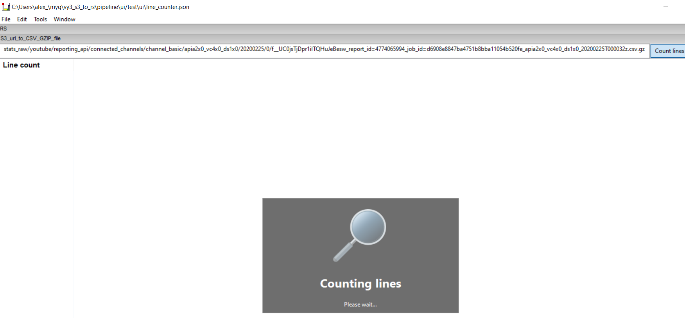

# S3-parquet-files-row-counter
Count rows in all parquet files using S3 SELECT


## Define bucket and directory
```Python
    bucket_name	= 'my-data-test'
    bucket_prefix='all_files/'
```


## Execute

```python s3_row_counter.py```

## Output

	S3 key:  in/test_1.parquet
	S3 key:  in/test_2.parquet
	S3 key:  in/test_3.parquet
	S3 key:  in/test_b1.parquet
	S3 key:  in/test_b2.parquet
	File line count: 42
	File line count: 23
	File line count: 31
	File line count: 8023
	File line count: 27715
	-->Total rows: 35834
	s3_count.py executed in 1.19 seconds.
	
## Total

**Total rows: 35834**


# Async counter

```python async_counter.py```

	Total: 35834
	async_counter.py executed in 0.23 seconds.


## wxPython UI
```bash
python cli.py  -nop 2 -r DEV -p ui/test -pa test-data tast/apia2x0_vc4x0_ds1x0/20200225/0/f__UC0jsTjDpr1iITQHuJeBesw_report_id=4774065994_job_id=d6908e8847ba4751b8bba11054b520fe_apia2x0_vc4x0_ds1x0_20200225T000032z.csv.gz -ui -f line_counter
```

Opens to:



After count:


